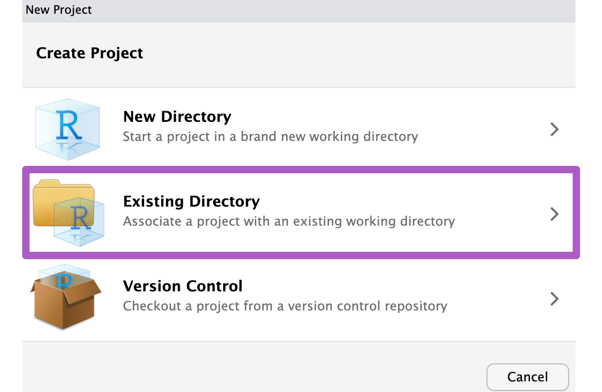
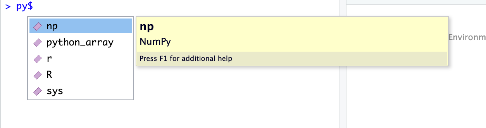

layout: true

<div class="my-footer">
<span> R meets Python  CDMX <a> http://bit.ly/RmeetsPython </a> </span>

<span-right>
<a href="https://twitter.com/ixek">`r shiny::icon("twitter")` </a> @ixek
<a href="https://github.com/trallard">`r shiny::icon("github-alt")` </a> @trallard
</span-right></div>


      
---

# ¡Gracias por venir!

- **Recordemos**: hay un código de conducta que toas y todos debemos observar todo el tiempo. Si notas algo que no va de acuerdo al código de conducta contacta a tus organizadoras.

- No vamos a tomar preguntas después de las presentaciones pero puedes hablar con las ponentes en el descanso.

- Necesitas tener una cuenta de GitHub para seguir el tutorial.

---
class: middle 

# Gracias a todas las personas que hicieron esto posible

- Pyladies CDMX

- RLadies CDMX

- Microsoft developer advocacy (Cynthia Zanoni ✨)

- Stickermule

- Platzi


---

# ¿Quién soy y  por qué estoy acá?
.pull-left[

]

.pull_right[
## Tania Allard

- Developer Advocate en Microsoft

- Organizadora de PyLadies NorthWest UK

- Miembro Rforwards - comunidad

- Fellow de la Python Software Foundation

- Y un montón de cosas mas
]

---
class: center, middle

# También 💜 Python y R


---

# Objetivos

Este tutorial está diseñado para:
- usuarios principiantes e intermedios de R y/o Python


# Qué vamos a aprender:
- **Principiante**: uso básico de Python y su uso desde R para proyectos multi lenguaje

- **Intermedio**: mejore prácticas para trabajar con Python desde R

---

# Al final del tutorial podremos:

- Pasar objetos entre sesiones simultáneasd de Ptyhon y R

- Usar métodos de Python en código de R

- Usar snippets de Python dentro de tu workflow en R (no necesitamos comprender al 100 lo que hacen `r emo::ji("shrug")`)

Si tienes un entendimiento general de lo que Python hace y para qué son los métodos puedes usar reticulate.

---

# ¿Por qué usar reticulate?

### Hacer tu trabajo más rápido
- Los scientíficos de datos nos caracterisamos por nuestra habilidad para resolver problemas
- El lenguaje debe ser secundario `r emo::ji("point_up")`
- Evitar refactorizar o mantender dos codebases

### Facilitar colaboración
- Te permite aprovechar la experiencia y habilidades de todo el equipo
- Resuelve el problema más grande de la industria de datos: la gente<sup>1</sup>
- Muchos scientíficos de datos usan los dos leguajes y son más felices<sup>2</sup>

.footnote[
[1] Mangano, 2019  
[2] Stack Overflow Developers' Survey, NanoMathius, 2018  
]


---

# Reticulate

### Características principales
.pull_right[
]

.pull_left[
1. Habilidad de llamar Python desde R

2. Traducción tntre objetos de R y Python

3. Uso flexible de diferentes entornos de Python
]

---

# Reticulate

### Puedes usar Python de las siguientes maneras

1. Interactivo usando la consola 
`repl_python()`

2. Ejecutando scripts de Python

3. Importando módulos de Python

4. En Rmarkdown

---

## Requisitos

* [RStudio 1.2](https://www.rstudio.com/products/rstudio/) 

* Python  
  [Anaconda 3](https://www.anaconda.com/distribution/) 
  
  
--

* `reticulate` Yo casi siempre uso la versión de desarrollo:
   ```{r eval=FALSE}
   devtools::install_github("rstudio/reticulate")  
   ```

* Paquetes de Python y R necesarios (no listados acá)

---

# Acceder a los materiales 

## JupyterHub

Para este tutorial tenemos un JupyterHub en la nube con todos los paquetes y librerías que necesitamos.

- Tienes que acceder en: http://bit.ly/Pyladies-hub

- Disponible sólo por hoy y necesitas una cuenta de GitHub

## En casa:

- El repositorio es: http://bit.ly/RmeetsPython


---


## Vamos a organizarnos

.pull-left[
Vamos a crear un projecto

File | New Project | Existing Directory

Browse

Abre el directorio "ML_musical"
]

.pull-right[
]

---

# Usando Python desde la terminal

## `r emo::ji("purple heart")` Comenzar una sesión de Python

Vamos a usar el método `repl_python()`:

```{r eval=FALSE}
> library('reticulate')

> repl_python() 
*Python 3.7.3 (/opt/conda/bin/python)
*Reticulate 1.13 REPL -- A Python interpreter in R.
>>>  
```


Inmediatamente te indica que versión de Python estás usando:

--

`>>>` Si ves esto quiere decir que estás en el REPL de Python

---

## Fundamentos de Python

Vamos a empezar creando un array

En R basta con hacer:
```{r eval=FALSE}
> r_array <- c(4, 5, 1, 6, 8)
```

--
En Python usamos listas:
```{python eval=FALSE}
>>> python_list = [4, 5, 1, 6, 8]
```

---


## Fundamentos de Python

Pero en Python las listas no siempre funcionan como un usuario de R esperaría.

Por ejemplo, cuál es el resultado de:

```{python eval=FALSE}
python_list = [4, 5, 1, 6, 8]
*python_list * 2
```

--

¿Esto?
```{python eval=FALSE}
python_list = [4, 5, 1, 6, 8]
python_list * 2
*[8, 10, 2, 12, 16]
```

--
No, en realidad es:
```{python eval=FALSE}
python_list = [4, 5, 1, 6, 8]
python_list * 2
*[4, 5, 1, 6, 8, 4, 5, 1, 6, 8]
```


`r emo::ji("shocked")`

---

# Fundamentos de Python

Para tener funcionalidades de arrays como los de R usamos el paquete [NumPy package](http://www.numpy.org/)<sup>1</sup>.

.footnote[
[1] NumPy is the fundamental package for scientific computing with Python. It is part of the 
SciPy ecosystem.  
Jones E, Oliphant E, Peterson P, et al. SciPy: Open Source Scientific Tools for Python, 2001-, http://www.scipy.org/.
]

--
```{python eval=FALSE}
>>> import numpy as np
>>> python_array = np.array([4, 5, 1, 6, 8])
```

--
Observa que en Python se usa el `.` para llamar métodos, por ejemplo: `numpy.method_name()`.

```{python eval=FALSE}
>>> python_array.max()
*8
```

---

Podemos checar el typo de objeto de nuestro array:

```{python eval=FALSE}
>>> type(python_array)
<class 'numpy.ndarray>
```

--
Y el tamaño del array

```{python eval=FALSE}
>>> python_array.size
```


El tamaño es un atributo de los objetos de tipo array en Numpy (y otros objetos).

--
Para ver todos los atributos de un objeto puedes usar:
```{python eval=FALSE}
>>>dir(python_array)
```

---

## ¿En dónde está el array?

Podemos accederlo desde R
```{r eval=FALSE}
> py$python_array
[1] 4 5 1 6 8
```


y podemos usar TAB después de `py$`

---

## Acceder objetos desde R

`reticulate` hace que los objetos se comporten como esperaríamos en RÑ

```{r eval=FALSE}
> py$python_array * 2
[1]  8 10  2 12 16
```

```{r eval=FALSE}
> py$python_array * py$python_array
[1] 16 25  1 36 64
```

--
Porque se convierten en objetos de R cuando los usamos

```{r eval=FALSE}
> class(py$python_array)
[1] "array"
```

`py$python_array` es un arreglo uni-dimensional


numpy.ndarray $\rightarrow$ array

---

# Funciones en objetos creados en Python 

Ahora podemos usar métodos de R en objetos creados en Python. Por ejemplo:

```{r eval=FALSE}
> mean(py$python_array)
[1] 4.8
```

--
... y la longitud
```{r eval=FALSE}
> length(py$python_array)
[1] 5
```

--
Se pueden asignar los objetos explícitamente:

```{r eval=FALSE}
> r_array <- py$python_array
```

---

# Métodos de Python en objetos creados en Python



Desde R tenemos acceso al objeto de `np` que es como importamos Numpy en Python.

---

# Métodos de Python en objetos creados en Python


.pull-left[

`r emo::ji("snake")` En Python aplicamos los métodos de `np` de la siguiente forma: 

_`object_name.method_name()`_

Por ejemplo encontramos la media de `python_array` con:

```{r eval=FALSE}
>>> python_array.mean()
4.8
```
]

--

.pull-right[

En R accedemos métodos `np` de la siguiente manera:

`py$np$` _`method_name(object_name)`_

Para usar el método mean en `py$python_array`:

```{r eval=FALSE}
> py$np$mean(py$python_array)
[1] 4.8
```
]

---

class: inverse, middle, center

# Python en R Markdown

---


# Python en R Markdown
## Objetivo

1. Desarrollar un mini tutorial para desarrollar nuestro entendimiento entre R y Python.

--
2. Importar, modelar y  visualizar datos de audio.

--

Vamos a crear algo como [clasificador_musica.html](clasificador_musica.html)

---

# Los datos

Vamos a trabajar con data de 9 piezas musicales:

* [Chopin - Ballade No. 1 in G Minor](https://www.youtube.com/watch?v=Zj_psrTUW_w) 
* [Corelli - Sonata da Chiesa, Op. 1 No. 1 in F major](https://www.youtube.com/watch?v=0fLbzkBRywU)
* [Mozart - Sonata in F major for piano and violin K 376](https://www.youtube.com/watch?v=iOq_lZWD8Lg)

--

El ejemplo original es de Michael Knight, de la Universidad de Bristol. 

-- 

Cada una de las piezas han sido segmentada en piezas de 5 segundos con 5000 features cada una.  Cada feature representa la distribución de energía de cada segmento de 5 segundos.  


Vamos a clasificar los segmentos.


---
## Los datos

 
Hay hast 100 segmentos por pieza.
```{r echo=FALSE}
datasummary <- read.table("ML_musical/datasummary.txt", header = T, sep= ",")

tab <- knitr::kable(datasummary[1:3], 
             format = "html",
             col.names = c("Instrument", "Piece", "Number of segments"),
             row.names = FALSE) 
kableExtra::kable_styling(tab,font_size = 13)
```

---

## Los datos

Dos xlxs por cada pieza 

* *name*_segments.xlsx  
  segmentos x features (row x column)
* *name*_SegmentInfo.xlsx  
  metadata por segmento: nombre de la pieza,  instrumento en la pieza, y el tiempo de comienzo y final del segmento
  
--

Hay `r sum(datasummary$Freq)` segmentos en total, de los cuales `r sum(datasummary$Freq[datasummary$Type == "Piano"])`  son de piezas de piano y `r sum(datasummary$Freq[datasummary$Type == "Violin"])`  corresponden al violín.
Los restantes `r sum(datasummary$Freq[datasummary$Type == "Violin and Piano"])` son de la sonata para piano y violin de Mozart.

---


class: inverted, middle

### Demo

---

## Haz tu propio tutorial

File -> New File -> Rmarkdown

Agrega un autor y un título

Puedes usar el demo como inspiración

---


---


